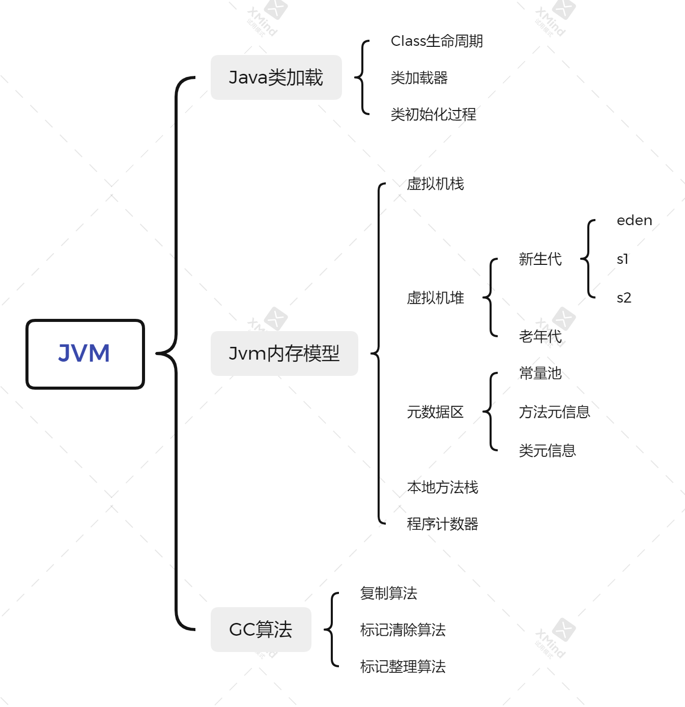
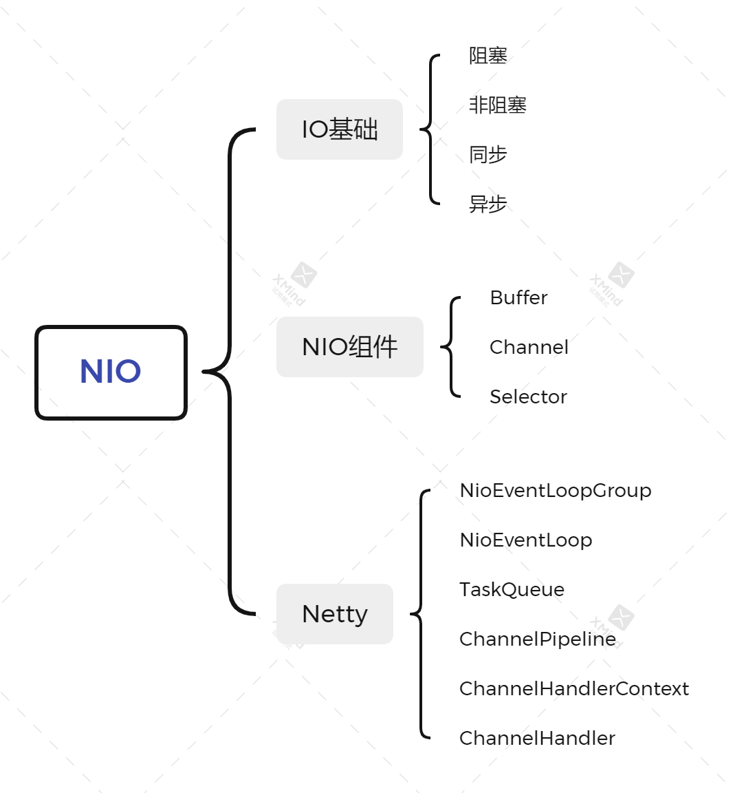

[TOC]

# 总结

## 1. JVM

JVM读取二进制的字节码流来获取对应的Class对象，管理Class的生命周期：加载，链接（验证，准备，解析），初始化，使用，卸载。加载在使用new指令，访问静态代码时触发；类加载通过类加载器实现，具有双亲委托，负责依赖，缓存加载的特点。初始化会在访问类构造器和静态代码时触发，类初始化顺序：先初始化父类后初始化子类，先初始化静态变量后初始化成员变量，先置为标准默认值后置为实际初始值。Jvm内存主要分为虚拟机堆，虚拟机栈，元数据区；堆又分为新生代（eden，s1，s2），老年代，堆里主要保存Java对象实例，线程共享；每个虚拟机栈保存方法调用的栈帧，线程独占；元数据区保存类结构信息，运行时常量等。GC主要发生在虚拟机堆，GC算法包括：复制算法，标记清除算法，标记整理算法。可达性算法包括：引用计数，引用追踪。JVM使用的收集器包括：Serial GC，Parallel GC，CMS，G1，ZGC。

## 2. NIO

Java IO分为BIO，NIO，AIO。阻塞IO&非阻塞IO：IO调用方法是否立即返回。同步IO&异步IO：请求线程是否执行实际IO操作。Java NIO是同步非阻塞IO，通过IO多路复用实现。Java NIO组件，Buffer：缓冲区；Channel：双工通道；Selector：选择器，使用一个线程阻塞监听多个channel。Netty基于NIO实现，使用主从Reactor线程模型，每个NioEventLoopGroup包含多个NioEventLoop，每个NioEventLoop包含一个selector和一个任务队列，主NioEventLoopGroup负责阻塞监听Accept事件，从NioEventLoopGroup负责每个连接的Read/Write事件，具体出入站逻辑通过ChannelPipeline中的channelHandler双向链表实现。

## 3. 并发编程

Java创建新线程的三种方式，继承Thread类，实现Runnable接口，实现Callable接口。Java线程状态：NEW：新建；RUNNABLE：就绪；BLOCKED：阻塞；WAITING：等待；TIMED_WAIT：超时等待；TERMINATED：终止。Thread.sleep()，Thread.yield()，td.join()，obj.wait()，obj.notify()可以改变线程状态。td.interupt()：进行中断标记，当线程进入或处于阻塞状态时抛出中断异常。Java并发原子性：原子类，锁机制；Java并发可见性：volatile关键字。Java锁机制：偏向锁，轻量级锁，重量级锁，Java由轻到重依次加锁升级，除偏向锁外不允许降级。Java并发工具：锁（Lock，Condition，ReadWriteLock，ReentrantLock，ReentrantReadWriteLock）；同步器（Semaphore，CountDownLatch，CyclicBarrier，Exchanger，Phaser）；执行器（ThreadPoolExecutor，Future，Callable，FutureTask，CompleteableFuture）；原子类（AtomicXXX）；并发集合（ConcurrentMap，CopyOnWriteArrayList）；Fork/Join框架。

## 4. Spring和ORM框架

Spring IOC：Spring通过依赖注入来实现控制反转，由容器来完成对象的创建和管理；不直接new对象，在外部配置依赖关系，由容器设置依赖到对象中。Spring AOP：Spring通过动态代理对代码进行扩展，实现水平方向的代码复用。循环依赖：Spring对于set单例注入的循环依赖利用对象创建的中间状态解决。Springboot对常用组件自动进行通用配置（默认值），也可以提供对应类型的bean或配置文件进行自定义，通过注解或配置文件进行功能启用关闭。ORM有全自动化框架（Hibernate）和半自动化框架（MyBatis）。Hibernate定义pojo和表的映射关系，sql语句由框架生成，MyBatis定义pojo和表的映射关系，sql语句需要手动编写；Hibernate在简单场景下使用方便，但是复杂场景麻烦，不利于调优，MyBatis对于简单sql编写繁琐，但是自由度高，方便调优。Spring事务管理通过AOP实现，需要向外抛出异常；自调用需要使用代理对象；对于多数据源，需要控制注解解析顺序，保证先注入数据源再开启事务；不同线程对应的连接对象不同，跨线程事务不同。

## 5. MySQL数据库和SQL

数据库范式（1NF，2NF，3NF，BCNF），事务ACID（原子性，一致性，隔离性，持久性），数据不一致性（丢失修改，不可重复度，幻读，脏读），事务隔离级别（未提交读，提交读，可重复读，串行化），两阶段锁协议。MySQL执行过程（连接器->分析器->优化器->执行器->存储引擎），MySQL日志：undolog（确保事务原子性，提供回滚和MVCC），redolog（确保事务持久性，重做事务），binlog（主从复制，故障恢复）。MySQL两阶段提交（写入undolog，写入redolog，commit-prepare，redolog刷盘，写入binlog，binlog刷盘，commit-commit）。MySQL的SQL执行顺序（from -> on -> join -> where -> group by -> having -> 聚合函数 -> select -> order by -> limit）。联合索引最左前缀原则和索引下推。

## 6. 分库和分表

垂直拆分：将一张表的不同字段分散到几张表中。水平拆分：根据特定规则将行数据分散到几张表中，各个表的结构相同，数据不同。垂直拆分：减小表结构，提升性能和容量，方便微服务改造；但是拆分过程复杂，业务侵入，拆分有上限。水平拆分：不改变表结构，业务侵入小，拆分上限高。分布式事务类型（XA事务，TCC事务，AT事务）。中间件：shardingsphere，seata，atomikos等。

## 7. RPC和微服务

RPC：远程过程调用。调用控制协议：包含远程调用的方法信息，方法入参。序列化协议：json，二进制，java序列化。传输协议：http，tcp。RPC调用过程：本地调用 -> 代理存根 -> 序列化 <-> socket通信 <-> 反序列化 -> 服务存根 -> 服务实现。微服务是在RPC基础上进行侧边增强：服务注册，服务发现，服务网关，服务路由，负载均衡，服务过滤，流量控制（限流，降级，熔断），认证中心，配置中心，服务监控，日志监控。

## 8. 分布式缓存

数据分类：静态数据，可复用的中间数据，热点数据，读写比大的数据。加载策略：启动全量加载，同步使用加载，延迟异步加载。缓存的风险：缓存穿透（大量并发查询不存在的key，导致直接将压力透传到数据库）（缓存空值的 key；布隆过滤器；延迟异步加载）；缓存击穿（某个 key失效的时候，正好有大量并发请求访问这个 key）（key的更新操作添加全局互斥锁；延迟异步加载）；缓存雪崩（当某一时刻发生大规模的缓存失效，导致直接将压力透传到数据库）（更新策略做到时间均匀；热数据分散到不同机器；主从集群；进行流量控制）。Redis应用场景：数据缓存，数据处理，全局一致计数，高效统计，发布订阅，分布式锁。

## 9. 分布式消息队列

消息队列优势：异步通信，系统解耦，削峰平谷，可靠通信。消息处理模式：点对点，发布订阅。消息处理保障：至多一次，至少一次，精确一次。消息协议：JMS，STOMP，AMQP，MQTT。Kafka：分布式的基于发布订阅的消息系统。支持：O（1）的持久化能力和访问能力；高吞吐率；不同分区内部消息顺序传输；离线和实时数据处理；在线水平扩展。概念：broker（kafka消息服务器），topic（消息类别），partition（物理分区），producer（消息发布者），consumer（消息订阅者），Consumer（消息订阅组）。

